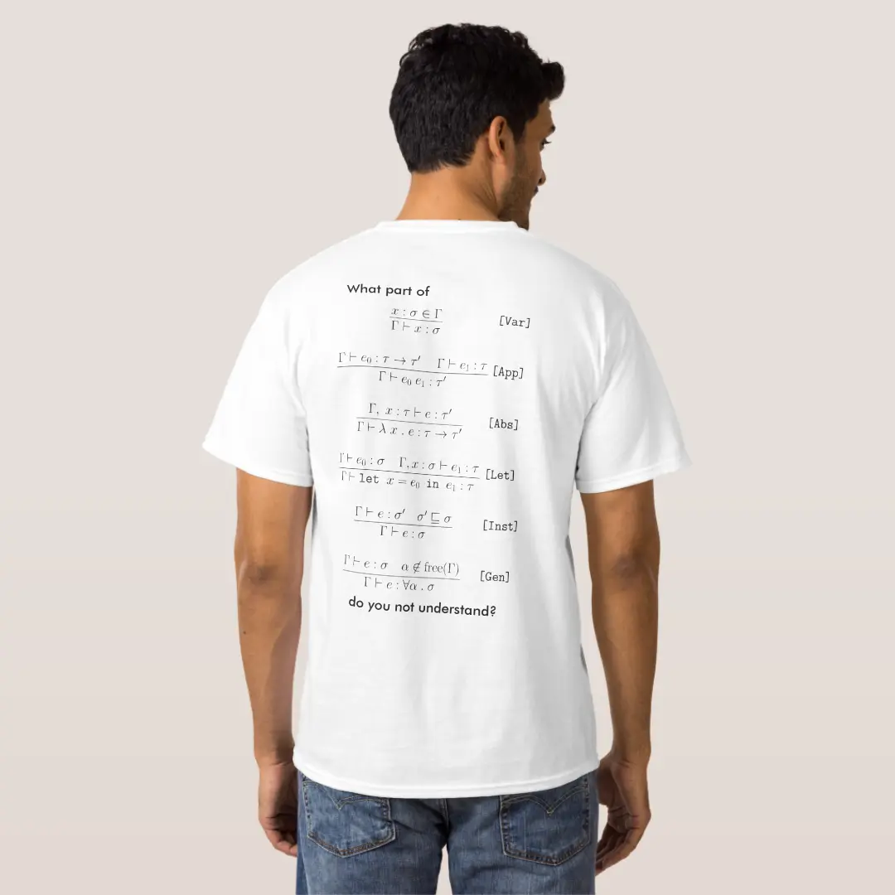

The type checker for my programming language [Wipple](https://wipple.gramer.dev) is one of the most complex programs I've ever written. In this article, I'll show you how to build one of your own!

### What does a type checker do?

The job of a (static) type checker is to ensure that values are used correctly throughout a program. For example, adding a string to a number would raise an error in a type-checked program instead of producing invalid results. To resolve the error, you have to be explicit: do you want to convert the string to a number and add the two numbers, or convert the number into a string and concatenate the two strings?

Modern languages also support type inference, a way to automatically determine the types of values in the program without requiring explicit type annotations most of the time. Wipple supports type inference as well as a number of other features that I'll explain in future articles!

### Basic type inference

Let's start building our type checker with a function called `typecheck` that accepts an `Expr` (expression) and returns a `Ty` (type).

```rust
#[derive(Debug, Clone)]
enum Expr {
    String(&'static str),
    Int(i64),
}

#[derive(Debug, Clone, PartialEq, Eq)]
enum Ty {
    String,
    Int,
}

fn typecheck(expr: Expr) -> Ty {
    match expr {
        Expr::String(_) => Ty::String,
        Expr::Int(_) => Ty::Int,
    }
}
```

As you can see, the type of an expression is simply the "tag" or "discriminant" of the `Expr` enum. (That is, types represent a set of all possible values.) We can run some tests, too:

```rust
assert_eq!(typecheck(Expr::Int(42)), Ty::Int);
```

Next, let's add support for variables:

```rust
#[derive(Debug, Clone, Copy, PartialEq, Eq, Hash)]
struct Var(&'static str);

enum Expr {
    // ...
    Let(Var, Box<Expr>),
    Var(Var),
}

enum Ty {
    // ...
    Void,
}
```

We can type-check variables by maintaining a `TyCtx` (type context) mapping variables to types:

```rust
use std::collections::HashMap;

#[derive(Debug, Clone, Default)]
struct TyCtx {
    vars: HashMap<Var, Ty>,
}

fn typecheck(expr: Expr, ctx: &mut TyCtx) -> Ty {
    match expr {
        // ...
        Expr::Let(var, expr) => {
            let ty = typecheck(expr, ctx);
            ctx.vars.insert(var, ty);
            Ty::Void
        }
        Expr::Var(var) => {
            ctx.vars
                .get(var)
                .expect("variable used before being defined")
                .clone()
        }
    }
}
```

And let's test that:

```rust
let mut ctx = TyCtx::default();

let let_x = Expr::Let(Var("x"), Box::new(Expr::Int(42)));
let use_x = Expr::Var(Var("x"));

assert_eq!(typecheck(let_x, &mut ctx), Ty::Void);
assert_eq!(typecheck(use_x, &mut ctx), Ty::Int);
```

So far so good! Now, let's implement functions:

```rust
enum Expr {
    // ...
    Function(Var, Box<Expr>),
}

enum Ty {
    // ...
    Function(Box<Ty>, Box<Ty>),
}

fn typecheck(expr: Expr, ctx: &mut TyCtx) -> Ty {
    match expr {
        // ...
        Expr::Function(var, body) => {
            let body_ty = typecheck(body, ctx);

            // ???
        }
    }
}
```

Hmm... we need to give `var` a type before we can type-check `body`. In languages without type inference, we'd need to manually add a type annotation here. But we can do better!

### Laziness to the rescue!

The key insight — one that appears over and over throughout my adventures in building a compiler — is that we can be lazy: we can _defer_ type checking until later. We can do this by assigning a temporary _type variable_ to an expression and give that variable a type later on. Then, to build the final type-checked program, we look up the type assigned to each variable!

Let's split out our data into three kinds, _untypechecked_, _unresolved_ and _resolved_:

```rust
mod untypechecked {
    use super::*;

    #[derive(Debug, Clone)]
    pub struct Expr {
        pub kind: ExprKind,
    }

    #[derive(Debug, Clone)]
    pub enum ExprKind {
        String(&'static str),
        Int(i64),
        Let(Var, Box<Expr>),
        Var(Var),
        Function(Var, Box<Expr>),
    }
}

#[derive(Debug, Clone, Default)]
struct TyCtx {
    // ...
    next_ty_var: unresolved::TyVar,
}

impl TyCtx {
    fn new_ty_var(&mut self) -> unresolved::TyVar {
        let ty_var = self.next_ty_var;
        self.next_ty_var.0 += 1;
        ty_var
    }
}

mod unresolved {
    use super::*;

    #[derive(Debug, Clone, Copy, Default, PartialEq, Eq, Hash)]
    pub struct TyVar(pub usize);

    #[derive(Debug, Clone)]
    pub struct Expr {
        pub kind: ExprKind,
        pub ty: Ty,
    }

    #[derive(Debug, Clone)]
    pub enum ExprKind {
        String(&'static str),
        Int(i64),
        Let(Var, Box<Expr>),
        Var(Var),
        Function(Var, Box<Expr>),
    }

    #[derive(Debug, Clone, PartialEq, Eq)]
    pub enum Ty {
        Var(TyVar),
        String,
        Int,
        Void,
        Function(Box<Ty>, Box<Ty>),
        Error,
    }
}

mod resolved {
    use super::*;

    #[derive(Debug, Clone)]
    pub struct Expr {
        pub kind: ExprKind,
        pub ty: Ty,
    }

    #[derive(Debug, Clone)]
    pub enum ExprKind {
        String(&'static str),
        Int(i64),
        Let(Var, Box<Expr>),
        Var(Var),
        Function(Var, Box<Expr>),
    }

    #[derive(Debug, Clone, PartialEq, Eq)]
    pub enum Ty {
        String,
        Int,
        Void,
        Function(Box<Ty>, Box<Ty>),
        Error,
    }
}
```

Notice the introduction of `TyVar`, representing a type variable. We've also added a new field to the `TyCtx`, `next_ty_var`, that will be incremented each time we call `new_ty_var()`. Resolved expression types have no `Var` variant, since all the type variables should be resolved by then (or we'll raise an error).

Now let's reimplement `typecheck` to take an `untypechecked::Expr` and return an `unresolved::Expr`:

```rust
fn typecheck(expr: untypechecked::Expr, ctx: &mut TyCtx) -> unresolved::Expr {
    match expr.kind {
        untypechecked::ExprKind::String(value) => unresolved::Expr {
            kind: unresolved::ExprKind::String(value),
            ty: unresolved::Ty::String,
        },
        untypechecked::ExprKind::Int(value) => unresolved::Expr {
            kind: unresolved::ExprKind::Int(value),
            ty: unresolved::Ty::Int,
        },
        untypechecked::ExprKind::Let(var, value) => {
            let value = typecheck(*value, ctx);

            ctx.vars.insert(var, value.ty.clone());

            unresolved::Expr {
                kind: unresolved::ExprKind::Let(var, Box::new(value)),
                ty: unresolved::Ty::Void,
            }
        }
        untypechecked::ExprKind::Var(var) => unresolved::Expr {
            kind: unresolved::ExprKind::Var(var),
            ty: ctx
                .vars
                .get(&var)
                .expect("variable used before being defined")
                .clone(),
        },
        untypechecked::ExprKind::Function(var, body) => {
            let input_ty = unresolved::Ty::Var(ctx.new_ty_var());
            ctx.vars.insert(var, input_ty.clone());

            let body = typecheck(body, ctx);
            let body_ty = body.ty.clone();

            unresolved::Expr {
                kind: unresolved::ExprKind::Function(
                    var,
                    Box::new(body),
                ),
                ty: unresolved::Ty::Function(
                    Box::new(input_ty),
                    Box::new(body_ty),
                ),
            }
        }
    }
}
```

And then let's implement `resolve` to convert an `unresolved::Expr` into a `resolved::Expr`:

```rust
#[derive(Debug, Clone)]
enum TyError {
    UnresolvedVar(unresolved::TyVar),
}

#[derive(Debug, Clone, Default)]
struct TyCtx {
    // ...
    errors: Vec<TyError>,
}

fn resolve(expr: unresolved::Expr, ctx: &mut TyCtx) -> resolved::Expr {
    resolved::Expr {
        kind: match expr.kind {
            unresolved::ExprKind::String(value) => resolved::ExprKind::String(value),
            unresolved::ExprKind::Int(value) => resolved::ExprKind::Int(value),
            unresolved::ExprKind::Let(var, expr) => {
                resolved::ExprKind::Let(var, Box::new(resolve(*expr, ctx)))
            }
            unresolved::ExprKind::Var(var) => resolved::ExprKind::Var(var),
            unresolved::ExprKind::Function(input, body) => {
                resolved::ExprKind::Function(input, Box::new(resolve(*body, ctx)))
            },
        },
        ty: resolve_ty(expr.ty, ctx),
    }
}

fn resolve_ty(ty: unresolved::Ty, ctx: &mut TyCtx) -> resolved::Ty {
    match ty {
        unresolved::Ty::Var(var) => {
            // We'll see why this is an error later on
            ctx.errors.push(TyError::UnresolvedVar(var));

            resolved::Ty::Error
        },
        unresolved::Ty::String => resolved::Ty::String,
        unresolved::Ty::Int => resolved::Ty::Int,
        unresolved::Ty::Void => resolved::Ty::Void,
        unresolved::Ty::Function(input, output) => resolved::Ty::Function(
            Box::new(resolve_ty(*input, ctx)),
            Box::new(resolve_ty(*output, ctx)),
        ),
        unresolved::Ty::Error => resolved::Ty::Error,
    }
}
```

### Unification

Great, now we have all the infrastructure in place! Next, we'll actually assign types to these type variables using a process called _unification_.

Unification is basically equality checking with variables thrown in. Here are the rules:

1. If either side is a variable, assign the variable to the other side.
2. Otherwise, check if the two sides are equal, recursively unifying any sub-terms.

How do we keep track of which type variable is assigned to which type? The same way we kept track of regular variables!

```rust
struct TyCtx {
    // ...
    substitutions: HashMap<unresolved::TyVar, unresolved::Ty>,
}
```

Now let's define a function `unify` based on the above rules:

```rust
enum TyError {
    // ...
    MismatchedTypes(unresolved::Ty, unresolved::Ty),
}

fn unify(mut actual: unresolved::Ty, mut expected: unresolved::Ty, ctx: &mut TyCtx) -> Result<(), TyError> {
    actual.apply(ctx);
    expected.apply(ctx);

    match (actual, expected) {

    }
}
```

We'll do all the rules later. And what about that `apply` function? That's for retrieving the assigned types for all the type variables within a type:

```rust
impl unresolved::Ty {
    fn apply(&mut self, ctx: &TyCtx) {
        match self {
            unresolved::Ty::Var(var) => {
                if let Some(ty) = ctx.substitutions.get(var) {
                    *self = ty.clone();

                    // This is necessary when there's a multi-step substitution
                    // (say, A -> B, B -> C, C -> D) -- we want to resolve as
                    // deeply as possible (ie. A -> D)
                    self.apply(ctx);
                }
            }
            unresolved::Ty::Function(input, output) => {
                input.apply(ctx);
                output.apply(ctx);
            }
            _ => {}
        }
    }
}
```

Notice that this function is different from `resolve` — instead of raising an error when a type contains variables (which would indicate an unknown type), we just want to resolve as many variables as possible so that `unify` is able to identify the variables that actually need to be substituted.

OK, now let's implement `unify`!

```rust
enum TyError {
    // ...
    Recursive(unresolved::TyVar),
}

match (actual, expected) {
    (unresolved::Ty::Var(var), ty) | (ty, unresolved::Ty::Var(var)) => {
        // Don't want to cause an infinite loop by substituting a variable with
        // itself!
        if let unresolved::Ty::Var(other) = ty {
            if var == other {
                return Ok(());
            }
        }

        if ty.contains(&var) {
            Err(TyError::Recursive(var))
        } else {
            ctx.substitutions.insert(var, ty);
            Ok(())
        }
    }
}
```

Alright, that's the first rule. What's this `contains` function? It just checks to make sure the variable to which we're trying to assign doesn't appear in the type — otherwise we would cause an infinite loop. `contains` would return `true` in a situation like this Wipple program:

```wipple
illegal : x -> (x x :: Number)
```

What's the type of `x` here? Since `x` is passed to itself, the type must be `_ -> Number`, where `_` (a type variable) is `_ -> Number`. As you can see, the input type of the function is infinitely recursive! And Wipple indeed raises an error when this occurs:

```
error: recursive type
 --> playground:1:19
  |
1 | illegal : x -> (x x :: Number)
  |                   ^ the type of this references itself
```

[Here's the exact line in the Wipple compiler](https://github.com/wipplelang/wipple/blob/7710a39a6e76a7bb53315a933db2b0bd0acc2a99/frontend/src/analysis/typecheck/engine.rs#L177) where this error is raised!

The implementation of `contains` is pretty straightforward:

```rust
impl unresolved::Ty {
    fn contains(&self, var: &unresolved::TyVar) -> bool {
        match self {
            unresolved::Ty::Var(other) => var == other,
            unresolved::Ty::Function(input, output) => {
                input.contains(var) || output.contains(var)
            }
            _ => false,
        }
    }
}
```

Let's go on!

```rust
match (actual, expected) {
    // ...
    (unresolved::Ty::String, unresolved::Ty::String)
    | (unresolved::Ty::Int, unresolved::Ty::Int)
    | (unresolved::Ty::Void, unresolved::Ty::Void) => Ok(()),
}
```

These three patterns represent our primitive types, which trivially unify with themselves.

Next up is functions, which demonstrate the recursive nature of the algorithm:

```rust
match (actual, expected) {
    // ...
    (
        unresolved::Ty::Function(actual_input, actual_output),
        unresolved::Ty::Function(expected_input, expected_output)
    ) => {
        unify(*actual_input, *expected_input, ctx)?;
        unify(*actual_output, *expected_output, ctx)?;

        Ok(())
    }
}
```

And finally, we have our error type. `Error` is what's called a _bottom type_, meaning it unifies with every other type — we want existing errors to propagate throughout the program instead of causing more type errors!

```rust
match (actual, expected) {
    // ...
    (unresolved::Ty::Error, _) | (_, unresolved::Ty::Error) => Ok(()),
}
```

In a future article, I'll show you how to implement a true bottom type for things like functions that don't return.

Now we just need a catch-all for any unmatching types:

```rust
match (actual, expected) {
    // ...
    (actual, expected) => Err(TyError::MismatchedTypes(actual, expected)),
}
```

Fantastic, that's our unification algorithm! Now let's go back to `resolve_ty` and resolve the type variables using our `substitutions`:

```rust
fn resolve_ty(mut ty: unresolved::Ty, ctx: &mut TyCtx) -> resolved::Ty {
    ty.apply(ctx);

    // ...
}
```

Note that apart from adding `apply`, the code is unchanged — that's because if the `unresolved::Ty::Var` pattern is matched even after substituting all variables, then one or more variables were never assigned a type, and we should raise an error.

### Adding more constructs

Currently we just have some primitive constructs whose types are determined trivially. In order for all our work to be useful, we need to add some constructs that restrict the types they accept. We'll add two to start with: type annotations and calling!

First is type annotations. We'll use the `Ty` from the `unresolved` module to keep things simple, but in an actual compiler you'd probably have some kind of `TyAnnotation` value you would need to convert to a `Ty`. [Check out how Wipple does it!](https://github.com/wipplelang/wipple/blob/7710a39a6e76a7bb53315a933db2b0bd0acc2a99/frontend/src/analysis/typecheck/mod.rs#L2675-L2890)

```rust
mod untypechecked {
    pub enum ExprKind {
        // ...
        Annotate(Box<Expr>, unresolved::Ty),
    }
}

fn typecheck(expr: untypechecked::Expr, ctx: &mut TyCtx) -> unresolved::Expr {
    match expr.kind {
        // ...
        untypechecked::ExprKind::Annotate(expr, ty) => {
            let expr = typecheck(*expr, ctx);

            if let Err(error) = unify(expr.ty.clone(), ty, ctx) {
                ctx.errors.push(error);

                return unresolved::Expr {
                    kind: expr.kind,
                    ty: unresolved::Ty::Error,
                }
            }

            expr
        }
    }
}
```

Nothing too complicated here — we take the type annotation (`ty`) and unify it with the expression's type.

And finally, let's implement calling:

```rust
mod untypechecked {
    pub enum ExprKind {
        // ...
        Call(Box<Expr>, Box<Expr>),
    }
}

mod unresolved {
    pub enum ExprKind {
        // ...
        Call(Box<Expr>, Box<Expr>),
    }
}

mod resolved {
    pub enum ExprKind {
        // ...
        Call(Box<Expr>, Box<Expr>),
    }
}

fn typecheck(expr: untypechecked::Expr, ctx: &mut TyCtx) -> unresolved::Expr {
    match expr.kind {
        // ...
        untypechecked::ExprKind::Call(function, input) => {
            let function = typecheck(*function, ctx);
            let input = typecheck(*input, ctx);

            let output_ty = unresolved::Ty::Var(ctx.new_ty_var());

            if let Err(error) = unify(
                function.ty.clone(),
                unresolved::Ty::Function(
                    Box::new(input.ty.clone()),
                    Box::new(output_ty.clone()),
                ),
            ) {
                ctx.errors.push(error);

                return unresolved::Expr {
                    kind: unresolved::ExprKind::Call(
                        Box::new(function),
                        Box::new(input),
                    ),
                    ty: unresolved::Ty::Error,
                }
            }

            unresolved::Expr {
                kind: unresolved::ExprKind::Call(
                    Box::new(function),
                    Box::new(input),
                ),
                ty: output_ty,
            }
        }
    }
}

fn resolve(expr: unresolved::Expr, ctx: &mut TyCtx) -> resolved::Expr {
    resolved::Expr {
        kind: match expr.kind {
            // ...
            unresolved::ExprKind::Call(function, input) => resolved::ExprKind::Call(
                Box::new(resolve(*function, ctx)),
                Box::new(resolve(*input, ctx)),
            ),
        },
        // ...
    }
}
```

The rule for function calls is the most complex rule in our type system, but essentially it unifies the function type we've determined from `function` with the function type we want to have — one that accepts a value whose type matches `input`. We don't care what the output type is here, so we just create a type variable and use that as the output. If you're implementing your type checker in a language other than Rust, you can ignore all the `clone()`s — those have to do with Rust's [ownership semantics](https://doc.rust-lang.org/book/ch04-01-what-is-ownership.html) and aren't part of the type checker logic.

With all that in place, we can test our type checker!

```rust
let mut ctx = TyCtx::default();

let untypechecked_program = vec![
    // let identity = (x) => x
    untypechecked::Expr {
        kind: untypechecked::ExprKind::Let(
            Var("identity"),
            Box::new(untypechecked::Expr {
                kind: untypechecked::ExprKind::Function(
                    Var("x"),
                    Box::new(untypechecked::Expr {
                        kind: untypechecked::ExprKind::Var(
                            Var("x"),
                        ),
                    }),
                ),
            }),
        ),
    },
    // identity(42)
    untypechecked::Expr {
        kind: untypechecked::ExprKind::Call(
            Box::new(untypechecked::Expr {
                kind: untypechecked::ExprKind::Var(Var("identity")),
            }),
            Box::new(untypechecked::Expr {
                kind: untypechecked::ExprKind::Int(42),
            }),
        ),
    },
];

let unresolved_program = untypechecked_program
    .into_iter()
    .map(|expr| typecheck(expr, &mut ctx))
    .collect::<Vec<_>>();

let resolved_program = unresolved_program
    .into_iter()
    .map(|expr| resolve(expr, &mut ctx))
    .collect::<Vec<_>>();

println!("{:#?}", resolved_program);
println!("{:#?}", ctx.errors);
```

Try adding another call to `identity`, but this time with a `String` — you should get a `MismatchedTypes` error!

---

Congratulations, you've just implemented a working type checker with built-in type inference! [Here is the finished code for reference.](https://gist.github.com/WilsonGramer/8d6438163213d47ced0eedc8fb87f588) If you'd like to read more about the theory behind all this, you can look into [the Hindley-Milner type system](https://en.wikipedia.org/wiki/Hindley%E2%80%93Milner_type_system). Its four main constructs are `Let` (defining variables), `Var` (referencing variables), `Abs` (abstraction, aka. functions), and `App` (application, aka. function calls), which correspond to the constructs we implemented above!

[](https://www.zazzle.com/hindley_milner_type_inference_t_shirt-235812502357339841)

In the future, I'll write up an article showing how to type-check various other common constructs, like blocks, loops and pattern matching. After that, I'll explain how Wipple implements generics and typeclasses, two powerful features that work together to enable highly expressive and reusable code. Until then, I hope you learned something!

### Other resources

-   The [polytype](https://github.com/lucasem/polytype-rs) library implements a similar type system — I used this library as the basis for Wipple's type checker.
-   [This presentation](https://www.youtube.com/watch?v=oPVTNxiMcSU) also implements a Hindley-Milner type system in Scala.
